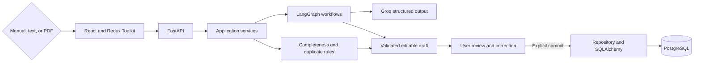

# AI-Powered Pharmaceutical Complaint Management System

A full-stack complaint-intake application for pharmaceutical quality teams. It turns
unstructured complaint text or selectable-text PDFs into an editable complaint draft,
adds decision-support information, and writes the record to PostgreSQL only after an
explicit user commit.

The project demonstrates a controlled boundary between AI assistance and the quality
record: Groq and LangGraph help structure and assess a complaint, while local schema
validation, deterministic rules, and the user determine what can be committed.

> This is a demonstration and decision-support system, not a validated production QMS.
> AI output requires review by authorised quality personnel.

## What it does

- Accepts manual complaint entry, pasted complaint text, and selectable-text PDFs.
- Extracts structured API and FDF complaint fields with a Groq-hosted LLM.
- Produces a preliminary category, severity, rationale, risk assessment, next action,
  and information gaps.
- Calculates complaint completeness with deterministic local rules.
- Identifies possible duplicate complaints using explainable, rule-based scoring.
- Generates advisory root-cause, investigation, corrective-action, and
  preventive-action recommendations.
- Applies conversational corrections through an allowlisted patch workflow while
  preserving unrelated fields.
- Keeps AI processing separate from persistence and requires an explicit commit.
- Lists committed complaints and retrieves individual records from PostgreSQL.
- Preserves the draft and selected PDF after retryable processing failures.

## Architecture and workflow



Text and PDF processing follow a LangGraph pipeline that normalizes input, extracts
fields, validates the extraction, assesses quality and risk, calculates completeness,
generates RCA/CAPA guidance, validates the result, and prepares the response. A
separate correction graph proposes and validates field-level patches before merging
them into the draft.

Neither graph writes to the database. `POST /api/complaints` is the only endpoint that
creates a complaint record.

### Engineering approach

- Layered React, API, service, AI-provider, repository, and persistence boundaries
- Redux Toolkit for explicit asynchronous UI state transitions
- Dependency injection through FastAPI dependencies and service constructors
- Repository pattern with service-owned commit and rollback
- Pydantic and Zod validation at backend and frontend boundaries
- Replaceable AI-provider protocol around the Groq implementation
- Deterministic completeness and duplicate scoring outside the LLM
- Separate initial-processing and correction LangGraph workflows
- Alembic-managed PostgreSQL schema and concurrency-safe complaint numbering
- Structured provider-error translation and retry-aware frontend behavior

See [System Architecture](docs/architecture.md) and
[LangGraph Workflows](docs/langgraph-workflows.md) for the detailed design.

## Technology stack

| Area | Technology |
| --- | --- |
| Frontend | React 18, TypeScript, Redux Toolkit, React Hook Form, Zod, Axios |
| Styling | Tailwind CSS, Google Inter |
| Backend | Python 3.11+, FastAPI, Pydantic |
| AI orchestration | LangGraph |
| LLM provider | Groq SDK with structured JSON Schema output |
| PDF processing | PyMuPDF; selectable-text PDFs only |
| Persistence | PostgreSQL 16, async SQLAlchemy, asyncpg, Alembic |
| Testing | Pytest, Vitest, Testing Library, Playwright Core |
| Delivery | Docker Compose, Uvicorn, Nginx |

The default Groq model is `openai/gpt-oss-120b` and can be changed through
`GROQ_MODEL`. Model output is parsed into strict schemas before it reaches the
application workflow. See [LLM Integration and Safety](docs/llm-integration-and-safety.md)
for provider behavior and decision boundaries.

## Getting started

### Prerequisites

- Docker Desktop with Docker Compose
- A Groq API key

Node.js 20+ and Python 3.11+ are required only when running or testing services
outside Docker.

### Configuration

From the repository root, create the local environment file:

```powershell
Copy-Item .env.example .env
```

Set the key in `.env`:

```dotenv
GROQ_API_KEY=your_groq_api_key
```

Important configuration values:

| Variable | Default | Purpose |
| --- | --- | --- |
| `GROQ_MODEL` | `openai/gpt-oss-120b` | Groq model identifier |
| `MAX_UPLOAD_SIZE_MB` | `10` | Maximum uploaded PDF size |
| `MAX_PDF_PAGES` | `50` | Maximum PDF page count |
| `MAX_PDF_TEXT_LENGTH` | `20000` | Maximum extracted PDF text length |
| `MAX_TEXT_INPUT_LENGTH` | `20000` | Maximum pasted-text length |
| `VITE_AI_REQUEST_TIMEOUT_MS` | `120000` | Frontend timeout for AI workflows |

Never commit a real API key.

### Run with Docker Compose

```powershell
docker compose up --build -d
```

Compose starts PostgreSQL, applies Alembic migrations during backend startup, and
serves the built frontend through Nginx.

| Service | URL |
| --- | --- |
| Application | http://localhost:5173 |
| OpenAPI / Swagger UI | http://localhost:8000/docs |
| Health check | http://localhost:8000/health |
| Database readiness | http://localhost:8000/ready |

Inspect service state with:

```powershell
docker compose ps
```

Stop the application with:

```powershell
docker compose down
```

The PostgreSQL volume is retained by this command.

## Demo data

The [`sample-data`](sample-data/) directory contains fictional examples:

- `fictional-fdf-complaint.pdf`
- `fictional-api-complaint.pdf`
- `fictional-textless-complaint.pdf`

The textless sample should produce a `NO_EXTRACTABLE_TEXT` response. OCR is not
implemented.

Suggested workflow:

1. Paste fictional complaint text or process an FDF/API PDF.
2. Review the populated complaint form and AI assessment.
3. Inspect completeness, possible duplicates, and RCA/CAPA guidance.
4. Correct a field with a natural-language instruction.
5. Review every updated field.
6. Commit the approved draft to the complaint ledger.

## API overview

| Method | Endpoint | Purpose |
| --- | --- | --- |
| `GET` | `/health` | Application liveness |
| `GET` | `/ready` | PostgreSQL connectivity |
| `POST` | `/api/complaints/process-text` | Process unstructured complaint text |
| `POST` | `/api/complaints/process-document` | Process a selectable-text PDF |
| `POST` | `/api/complaints/correct` | Apply a validated conversational correction |
| `POST` | `/api/complaints/check-duplicates` | Run deterministic duplicate scoring |
| `POST` | `/api/complaints` | Commit a reviewed complaint |
| `GET` | `/api/complaints` | List committed complaints with pagination |
| `GET` | `/api/complaints/{complaint_id}` | Retrieve one committed complaint |

Detailed request, response, validation, and error contracts are available in
[API Documentation](docs/api-documentation.md) and the running Swagger UI.

## Development and verification

### Backend

```powershell
cd backend
python -m venv .venv
.\.venv\Scripts\python.exe -m pip install -e ".[dev]"
.\.venv\Scripts\python.exe -m pytest
.\.venv\Scripts\python.exe -m ruff check app tests
.\.venv\Scripts\python.exe -m mypy app
```

Provider smoke tests are credential-gated, and PostgreSQL integration tests require
their documented database configuration. Expected skips therefore depend on the test
environment.

### Frontend

```powershell
cd frontend
npm.cmd ci
npm.cmd test
npm.cmd run typecheck
npm.cmd run lint
npm.cmd run build
```

The repository includes unit, API, service, graph, provider-contract, PDF-validation,
PostgreSQL integration, frontend component/state, and browser-acceptance coverage.
See [Testing and Verification](docs/testing-and-sprints.md) for scope, prerequisites,
and recorded evidence.

Current local verification:

| Check | Result |
| --- | --- |
| Backend Pytest suite | 107 passed, 28 environment-gated skips |
| Ruff | Passed |
| Strict MyPy | Passed |
| Frontend Vitest suite | 22 passed across 4 test files |
| TypeScript typecheck | Passed |
| ESLint | Passed |
| Frontend production build | Passed |

## Project structure

```text
.
|-- backend/
|   |-- app/
|   |   |-- ai/                 # LangGraph workflows, prompts, Groq provider
|   |   |-- api/                # FastAPI routes and dependencies
|   |   |-- core/               # Configuration, exceptions, error mapping
|   |   |-- infrastructure/     # Async database setup and ORM models
|   |   |-- repositories/       # Complaint persistence queries
|   |   |-- schemas/            # Pydantic request and response contracts
|   |   `-- services/           # Application and deterministic rule services
|   |-- alembic/                # Database migrations
|   `-- tests/                  # Backend and integration tests
|-- frontend/
|   |-- src/
|   |   |-- app/                # Redux store and typed hooks
|   |   |-- features/complaints # Complaint UI, state, schemas, and API client
|   |   `-- shared/             # Shared HTTP infrastructure
|   `-- scripts/                # Browser acceptance workflow
|-- docs/                       # Architecture, API, data, workflow, and test docs
|-- sample-data/                # Fictional PDF fixtures
`-- docker-compose.yml
```

## Safety boundaries and limitations

- AI output is advisory and always requires human review.
- Root-cause suggestions are hypotheses, not confirmed investigation findings.
- CAPA suggestions are not approved or implemented CAPA records.
- Duplicate scores identify possible matches; they do not confirm duplicates.
- AI processing and correction do not persist complaints automatically.
- PDF intake supports selectable text but not OCR.
- Authentication, role-based authorization, electronic signatures, immutable audit
  history, formal approval workflows, and validated-system controls are not included.
- Provider availability, authentication, rate limits, and latency affect AI features.
- The application has not been validated for regulated production use.

## Documentation

- [Software Requirements Specification](docs/srs.md)
- [System Architecture](docs/architecture.md)
- [LangGraph Workflows](docs/langgraph-workflows.md)
- [LLM Integration and Safety](docs/llm-integration-and-safety.md)
- [Database Design](docs/database-design.md)
- [API Documentation](docs/api-documentation.md)
- [Requirements Traceability](docs/requirements-traceability.md)
- [Testing and Verification](docs/testing-and-sprints.md)

