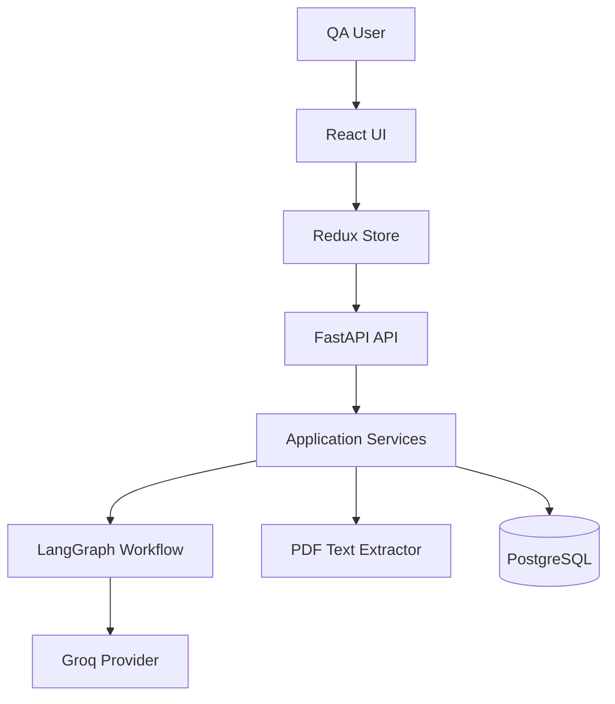
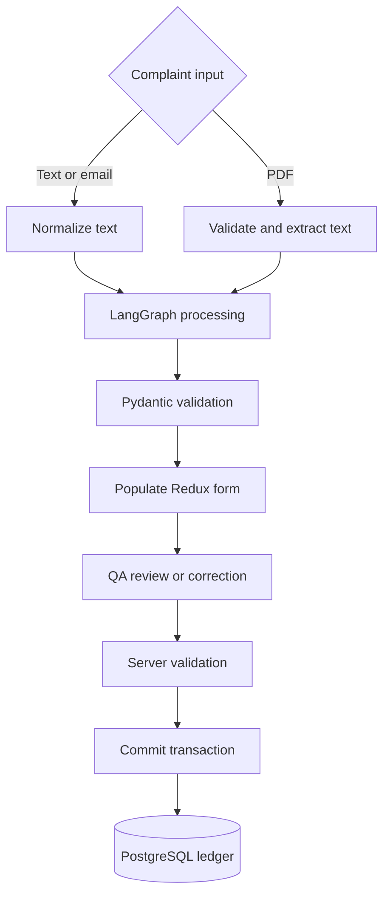
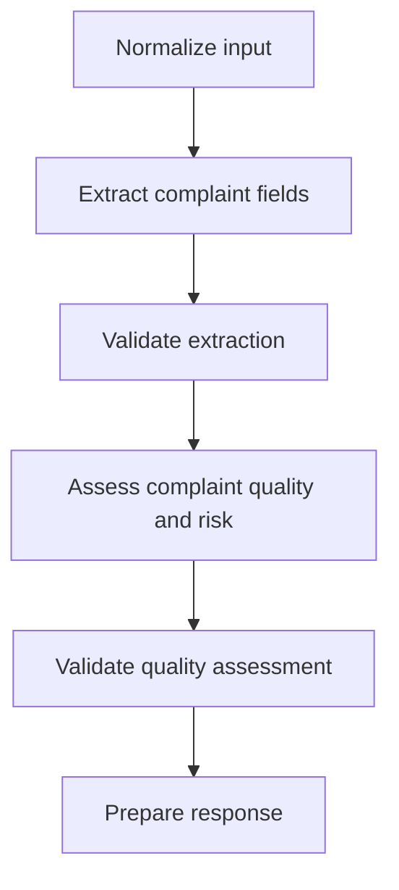
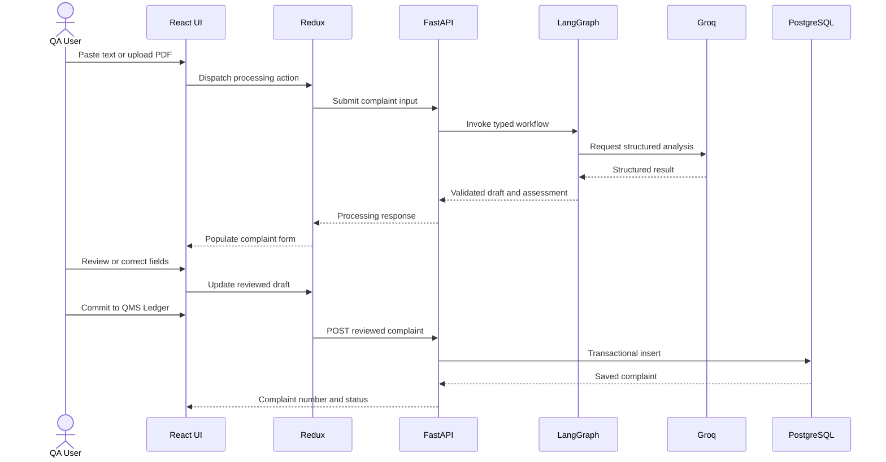

# System Architecture

## 1. Overview

The AI-Powered Pharmaceutical Customer Complaint Management System uses a modular full-stack architecture. React and Redux manage the user workspace and complaint draft. FastAPI exposes validated use cases. Application services coordinate AI and persistence operations. LangGraph orchestrates structured complaint processing through Groq. PostgreSQL stores only explicitly committed complaints.

The architecture applies SOLID principles pragmatically: components are separated when they have different reasons to change or require independent testing, without creating unnecessary interfaces for trivial functions.

## 2. Architectural goals

- Reproduce the complete assignment workflow
- Keep UI, HTTP, business rules, persistence, AI, and documents separate
- Prevent unvalidated LLM output from reaching the form or database
- Preserve drafts during recoverable failures
- Make external providers replaceable in tests
- Support API and FDF complaints through one processing pipeline
- Keep QA personnel responsible for final quality decisions

## 3. System architecture



### Boundaries

- React never calls Groq or PostgreSQL directly.
- Routes handle transport concerns, not business decisions.
- Services coordinate use cases and own database transaction outcomes.
- Repositories perform queries but do not call AI services.
- LangGraph coordinates AI steps but does not create HTTP responses.
- All AI results pass through Pydantic validation.
- Redux is the frontend source of truth for the working draft.

## 4. Frontend architecture

### Presentation

The complaint workspace contains:

- Origin and customer details
- Product and batch identification
- Facility and material impact
- Defect analysis
- AI Copilot risk assessment
- Copilot conversation and intake controls

Components render state and dispatch typed actions. They do not embed backend or AI logic.

### State management

Redux Toolkit stores:

- Complaint form draft
- Workflow status
- Conversation messages
- Processing stages and errors
- Extraction warnings
- Quality assessment
- Selected bonus results
- Commit response and complaint number

Async thunks call typed API modules. React Hook Form manages accessible input interaction while synchronizing validated values with Redux; Zod provides client validation.

### API integration

The shared Axios client owns base URL and common response handling. Feature API modules define complaint operations. Secrets are never included in the frontend build.

## 5. Backend architecture

| Layer | Responsibility |
|---|---|
| API routes | HTTP parsing, dependencies, status codes, response schemas |
| Application services | Use-case coordination and transaction decisions |
| Domain logic | Deterministic validation, completeness, scoring, patch merge |
| Repositories | Async SQLAlchemy persistence and queries |
| AI infrastructure | Groq adapter, prompts, LangGraph state/nodes |
| Document infrastructure | PDF validation and selectable-text extraction |
| Core | Settings, error mapping, logging, lifecycle |

Dependency direction points inward: application behaviour depends on provider and repository contracts, while concrete Groq, PyMuPDF, and SQLAlchemy code remains at infrastructure boundaries.

## 6. End-to-end data flow



### Manual flow

The user may fill the form without AI. Redux holds the draft, FastAPI validates the commit request, the complaint service assigns `COMMITTED`, and the repository writes it in one PostgreSQL transaction.

### Text flow

The user pastes a complaint. FastAPI validates the request, LangGraph normalizes and extracts fields through Groq, Pydantic validates the result, and Redux populates only supported values. The draft is not saved automatically.

### PDF flow

The backend validates the file and uses basic text extraction. Extracted text enters the same graph used for pasted text. A scanned PDF without readable text returns a clear error; production OCR is not required.

### Correction flow

The current draft and user instruction are processed into an allowlisted partial patch. The backend validates and merges only specified changes, then recalculates affected checks.

## 7. LangGraph workflow



Conversational corrections are planned for Sprint 5. Root-cause/CAPA suggestions and
duplicate detection remain planned Sprint 6 work and are not part of the current graph.

### Graph state

The typed state carries raw and normalized input, extracted complaint fields, warnings, assessment outputs, bonus results, assistant message, and controlled errors. Nodes remain individually testable.

### Provider strategy

The production provider uses the Groq SDK with an environment-configured model. Automated tests inject a deterministic fake provider. Provider errors are mapped into stable application errors; malformed output receives at most one controlled schema retry.

## 8. Request sequence



## 9. Persistence architecture

- PostgreSQL is the runtime and integration-test database.
- SQLAlchemy uses an asynchronous engine and sessions.
- Alembic manages schema evolution.
- UUIDs provide stable internal identifiers.
- A PostgreSQL sequence provides concurrency-safe human-readable numbers.
- Services own commit/rollback; repositories flush and query.
- Draft AI processing does not insert database rows.

## 10. Error handling

Failures use a standard envelope:

```json
{
  "error": {
    "code": "ERROR_CODE",
    "message": "Safe user-facing explanation",
    "details": null
  }
}
```

Validation, PDF, AI authentication, rate limit, timeout, malformed output, not-found, and database errors are mapped without exposing secrets or stack traces. The frontend preserves input and offers retry for recoverable failures.

## 11. Security and configuration

- Secrets reside in backend environment variables.
- `.env` files are excluded from Git and Docker build contexts.
- Inputs have type, length, and allowlist validation.
- SQLAlchemy parameterization prevents raw SQL concatenation.
- Complaint content is treated as untrusted data rather than model instruction.
- Logs exclude API keys and avoid unnecessary sensitive complaint content.

## 12. Deployment architecture

Docker Compose runs:

- Nginx-served React frontend on port 5173
- FastAPI backend on port 8000
- PostgreSQL on port 5432

PostgreSQL must become healthy before backend startup; the frontend depends on backend health. `/health` reports liveness, while `/ready` verifies PostgreSQL connectivity.

## 13. Limitations

This is a modular assignment MVP, not a validated production QMS. Scaling, authentication, electronic signatures, comprehensive audit trails, regulatory reporting, advanced OCR, and autonomous quality decisions are outside scope.
