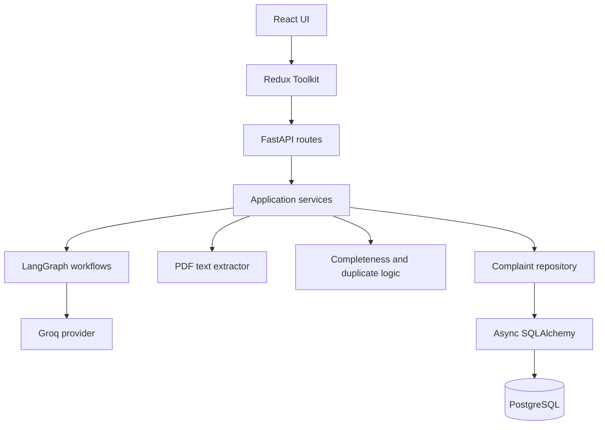
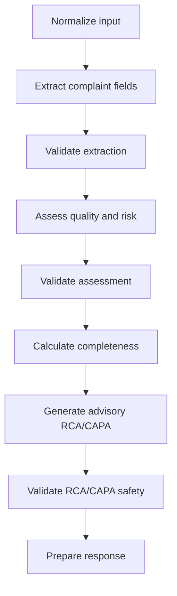
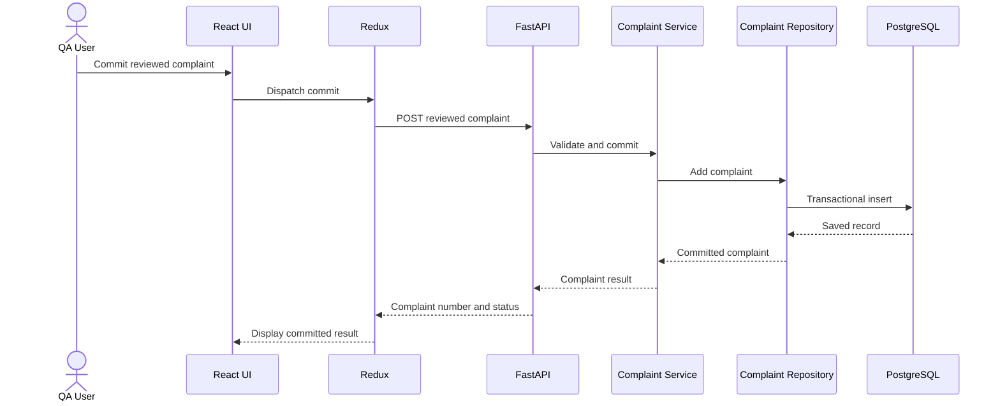

# System Architecture

## 1. Overview

The AI-Powered Pharmaceutical Customer Complaint Management System is a modular
full-stack application. React and Redux manage the complaint workspace, FastAPI
exposes validated use cases, LangGraph coordinates structured AI processing through
Groq, and PostgreSQL stores only explicitly committed complaints.

The architecture applies practical SOLID principles by separating components with
different responsibilities while avoiding unnecessary abstraction.

## 2. Main components



### Architectural boundaries

- React never calls Groq or PostgreSQL directly.
- Redux is the source of truth for the editable complaint draft.
- Routes handle HTTP transport and delegate use cases to services.
- Services coordinate workflows and own transaction outcomes.
- Repositories perform bounded persistence queries and writes.
- LangGraph coordinates AI and deterministic processing stages.
- Pydantic schemas remain the final authority for AI output validation.
- AI processing never persists a complaint automatically.

## 3. Frontend

The React frontend provides complaint intake, an editable complaint form, quality and
risk results, conversational corrections, completeness, duplicate matches, advisory
RCA/CAPA recommendations, and explicit commit controls.

Redux Toolkit stores the draft, workflow state, warnings, assessments, correction
results, and committed record. React Hook Form manages accessible form interaction,
Zod validates client input, and the shared Axios client communicates with FastAPI.
No credentials are included in the frontend build.

## 4. Backend layers

| Layer                | Responsibility                                                     |
| -------------------- | ------------------------------------------------------------------ |
| API routes           | HTTP parsing, dependency injection, status codes, response schemas |
| Application services | Use-case coordination and transaction ownership                    |
| Domain rules         | Completeness, duplicate scoring, validation, correction merging    |
| Repositories         | Async SQLAlchemy persistence and bounded queries                   |
| AI layer             | Groq adapter, prompts, provider contract, LangGraph nodes          |
| Document handling    | Bounded PDF upload reading and selectable-text extraction          |
| Core                 | Environment settings, error mapping, CORS, application lifecycle   |

The persistence path is:

```text
Application Service
→ Complaint Repository
→ Async SQLAlchemy
→ PostgreSQL
```

## 5. Complaint-processing workflow



A processing request may perform separate structured Groq calls for complaint
extraction, quality/risk assessment, and RCA/CAPA generation. LangGraph coordinates
these calls as one application workflow.

Every AI result is parsed and validated against strict Pydantic contracts. Trusted
human-review flags and disclaimers are enforced locally. Outputs containing prohibited
final regulatory decisions are rejected.

## 6. Input paths

### Text and email-style input

The user pastes complaint text. The backend validates its size, normalizes it, runs the
LangGraph workflow, and returns a validated draft. Processing does not create a ledger
record.

### PDF input

`app/services/documents.py` owns bounded upload reading and document-processing
coordination, while `PdfTextExtractor` isolates PyMuPDF operations. “Document
infrastructure” describes its responsibility, not its filesystem package.

Only selectable PDF text is supported. A textless or scanned PDF produces a controlled
error and preserves the user draft; production OCR is outside scope.

### Manual input

The user can complete or edit the form without AI. A complaint enters PostgreSQL only
after the user explicitly submits the reviewed commit request.

## 7. Conversational corrections

Sprint 5 uses a separate compiled correction LangGraph:

```text
Normalize instruction
→ Extract allowlisted patch
→ Validate patch
→ Merge atomically
→ Recalculate warnings
→ Reassess when relevant
→ Validate assessment
→ Recalculate RCA/CAPA when relevant
→ Validate RCA/CAPA
→ Prepare response
```

The correction graph traverses the reassessment node for every request. The node
regenerates the assessment and RCA/CAPA only for relevant field changes; otherwise,
it deterministically preserves existing validated results.

The provider interprets the correction instruction but never performs the merge.
Protected fields cannot be changed, unrelated values are preserved, and the correction
endpoint never writes to the ledger.

## 8. AI provider organization

Groq is the only production provider in the stable source. The model is configured
through `GROQ_MODEL`, with `openai/gpt-oss-120b` as the default.

The provider protocol and Groq adapter currently share `app/ai/providers.py` while
remaining logically separated through protocol-based dependency inversion. Automated
tests inject deterministic providers through the same contract; fake providers are
never registered as runtime fallbacks.

Provider authentication, rate-limit, timeout, malformed-output, and availability
errors are translated into controlled application errors. Malformed structured output
receives at most one controlled retry.

## 9. Explicit commit sequence



Services own commit and rollback. Repositories flush and query without independently
committing transactions.

## 10. Persistence

- PostgreSQL is the runtime and integration-test database.
- SQLAlchemy uses an asynchronous engine and request-scoped sessions.
- Alembic manages schema evolution.
- UUIDs provide stable internal identifiers.
- A PostgreSQL sequence generates concurrency-safe complaint numbers.
- Duplicate detection uses a bounded, newest-first candidate query.
- Completeness, duplicate results, and RCA/CAPA recommendations remain advisory.
- Draft processing and conversational correction do not insert ledger rows.

## 11. Error handling and safety

API failures use a consistent envelope:

```json
{
  "error": {
    "code": "ERROR_CODE",
    "message": "Safe user-facing explanation",
    "details": null
  }
}
```

Input size limits, PDF bounds, allowlisted correction fields, SQLAlchemy
parameterization, prompt/data separation, strict schemas, trusted disclaimers, and
human-review enforcement protect the workflow. Credentials, complaint content, raw
prompts, and provider responses are not intentionally exposed in API errors.

## 12. Deployment

Docker Compose runs:

- Nginx-served React frontend on port 5173
- FastAPI backend on port 8000
- PostgreSQL on port 5432

PostgreSQL must become healthy before the backend starts, and the frontend depends on
backend health. `/health` reports application liveness; `/ready` verifies PostgreSQL
connectivity without calling an AI provider.

## 13. Limitations

This project is an assignment-scale QMS workflow, not a validated production QMS. It
does not provide authentication, electronic signatures, production OCR, mailbox
integration, semantic duplicate detection, autonomous recall, final batch disposition,
regulatory approval, or investigation closure. All AI-generated assessments and
recommendations require review by authorised quality personnel.
