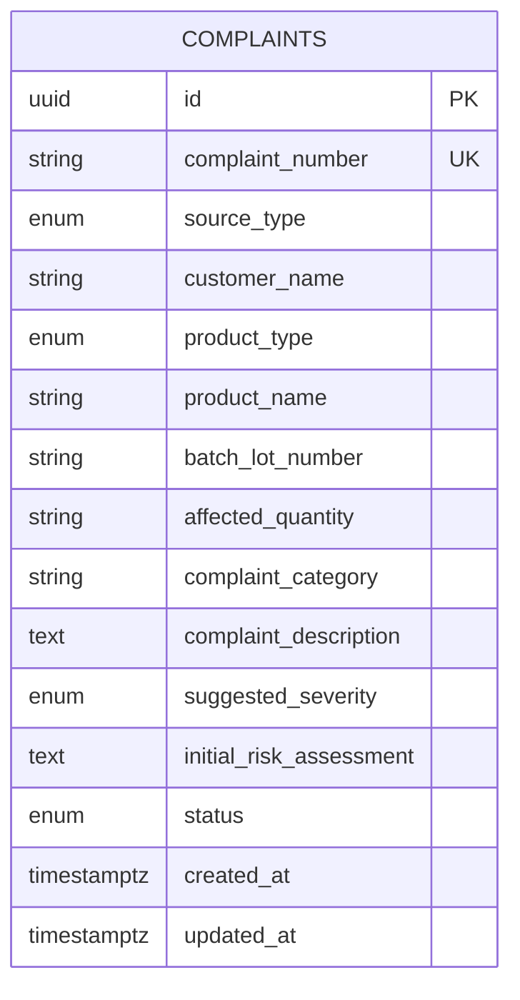

# Database and API Specification

## 1. Database overview

PostgreSQL stores reviewed complaints committed to the QMS ledger. Draft extraction and correction operations remain outside persistence until the user explicitly commits. SQLAlchemy provides asynchronous access, and Alembic controls schema versions.

## 2. Design decisions

- **UUID primary key:** stable internal identity without exposing sequence order.
- **Human-readable number:** `CMP-YYYY-NNNNNN` for demonstration and retrieval.
- **PostgreSQL sequence:** concurrency-safe allocation without `COUNT(*) + 1` races.
- **Text dates:** preserves partial values such as `March 2026` and explicit `Not Provided`.
- **Nullable intake fields:** complaints may initially omit valid information.
- **Timezone-aware timestamps:** consistent audit-oriented chronology.
- **Service-owned transactions:** one clear commit/rollback boundary.

Sequence values may contain gaps after rollback; this is expected and preferable to reusing identifiers.

## 3. Complaint entity

The implemented `complaints` table contains the following logical fields. Exact SQL lengths and enum names are governed by the repository migration.

| Field | Logical type | Nullable | Purpose / example |
|---|---|---:|---|
| `id` | UUID | No | Internal primary key |
| `complaint_number` | String, unique | No | `CMP-2026-000001` |
| `source_type` | Enum | No | `MANUAL`, later `TEXT` or `PDF` |
| `complaint_source` | String | Yes | `Pharmacy`, `Email` |
| `customer_name` | String | No for commit | `Apollo Pharmacy` |
| `product_type` | Enum | No | `API`, `FDF`, `UNKNOWN` |
| `product_name` | String | No for commit | `Amoxicillin Capsules` |
| `product_strength_grade` | String | Yes | `500 mg`, `IP/BP` |
| `batch_lot_number` | String | No for commit | `AMX240602` |
| `affected_quantity` | String | Yes | `12 capsules`, `25 kg (1 HDPE Drum)` |
| `manufacturing_date` | String | Yes | `March 2026` |
| `expiry_retest_date` | String | Yes | `February 2028`, `Not Provided` |
| `originating_site_block` | String | Yes | Manufacturing site/block |
| `impacted_non_product_materials` | String/text | Yes | Packaging or other material impact |
| `complaint_category` | String | No for commit | `Product Defect - Discoloration` |
| `complaint_description` | Text | No for commit | Structured defect narrative |
| `suggested_severity` | Enum | Yes | `MINOR`, `MAJOR`, `CRITICAL` |
| `initial_risk_assessment` | Text | Yes | AI-assisted risk rationale |
| `suggested_next_action` | Text | Yes | Suggested QA action |
| `status` | Enum | No | `PENDING_TRIAGE`, `READY_TO_COMMIT`, `COMMITTED` |
| `raw_input` | Text | Yes | Original text/PDF-extracted content |
| `created_at` | Timestamptz | No | Server creation time |
| `updated_at` | Timestamptz | No | Last update time |

### Indexes

- Unique index/constraint on `complaint_number`
- Index on `batch_lot_number`
- Index on `created_at`
- Functional index on lowercase product name

These indexes support retrieval, ordering, and later duplicate-candidate filtering.

## 4. Entity relationship diagram



Conversation persistence or explicit duplicate-link tables may be added later through new migrations if required. They are not part of the baseline complaints ERD.

## 5. Transaction lifecycle

1. FastAPI validates the request schema.
2. `ComplaintService` validates the commit use case and sets committed status.
3. `ComplaintRepository` adds and flushes the entity.
4. PostgreSQL allocates the sequence value and enforces constraints.
5. The service commits the transaction.
6. Any failure triggers rollback; no partial complaint remains.

## 6. API conventions

- Base path: `/api/complaints`
- JSON uses backend schema field names.
- UUIDs identify records internally.
- Errors use a consistent envelope.
- Unknown fields are rejected where strict schemas apply.
- Relevant strings are trimmed and bounded.

## 7. Implemented ledger endpoints

### POST `/api/complaints`

Commits a reviewed complaint. Returns HTTP `201 Created`.

Minimum required fields:

- `customer_name`
- `product_name`
- `batch_lot_number`
- `complaint_category`
- `complaint_description`

Example request:

```json
{
  "source_type": "MANUAL",
  "complaint_source": "Pharmacy",
  "customer_name": "Apollo Pharmacy",
  "product_type": "FDF",
  "product_name": "Amoxicillin Capsules",
  "product_strength_grade": "500 mg",
  "batch_lot_number": "AMX240602",
  "affected_quantity": "12 capsules",
  "manufacturing_date": "March 2026",
  "expiry_retest_date": "February 2028",
  "originating_site_block": null,
  "impacted_non_product_materials": "Primary packaging",
  "complaint_category": "Product Defect - Discoloration",
  "complaint_description": "Apollo Pharmacy reported discolored capsules from a sealed bottle.",
  "suggested_severity": "MAJOR",
  "initial_risk_assessment": "Potential product or packaging quality defect requiring QA review.",
  "suggested_next_action": "Initiate QA investigation and review retained samples.",
  "raw_input": null
}
```

Illustrative response:

```json
{
  "id": "11111111-2222-4333-8444-555555555555",
  "complaint_number": "CMP-2026-000001",
  "status": "COMMITTED",
  "source_type": "MANUAL",
  "customer_name": "Apollo Pharmacy",
  "product_type": "FDF",
  "product_name": "Amoxicillin Capsules",
  "batch_lot_number": "AMX240602",
  "complaint_category": "Product Defect - Discoloration",
  "created_at": "2026-08-17T14:50:00Z",
  "updated_at": "2026-08-17T14:50:00Z"
}
```

Possible responses: `201`, `422`, and a controlled server/database failure.

### GET `/api/complaints`

Returns deterministic newest-first pagination.

Query parameters:

- `page`: positive integer, default defined by the schema
- `page_size`: bounded positive integer, default defined by the schema

Illustrative response:

```json
{
  "items": [],
  "page": 1,
  "page_size": 20,
  "total": 0,
  "pages": 0
}
```

Invalid pagination returns HTTP `422`.

### GET `/api/complaints/{complaint_id}`

Returns one complete complaint.

- Existing UUID: `200 OK`
- Unknown UUID: `404 Not Found`
- Malformed UUID: `422 Unprocessable Entity`

### GET `/health`

Liveness endpoint independent of database state.

```json
{"status":"ok"}
```

### GET `/ready`

Readiness endpoint that verifies PostgreSQL connectivity.

```json
{"status":"ready"}
```

## 8. Processing endpoints

### POST `/api/complaints/process-text`

Accepts pasted complaint text/email and returns an unsaved validated draft.

```json
{"text":"Apollo Pharmacy reported discolored Amoxicillin capsules..."}
```

Response includes source type, extracted complaint, warnings, status, assistant message, and safe model metadata. It does not insert a database row.

### POST `/api/complaints/process-document`

Accepts multipart PDF upload, extracts readable text, and returns the same draft contract as text processing. Unsupported, oversized, corrupted, or textless PDFs return controlled errors. It does not commit.

### POST `/api/complaints/correct`

Accepts the current draft and a correction instruction. It returns an allowlisted validated patch or updated draft. It does not commit.

```json
{
  "current_complaint": {
    "batch_lot_number": "AMX240602",
    "affected_quantity": null
  },
  "instruction": "The batch is BMX240602 and quantity is 48 capsules."
}
```

Expected patch:

```json
{
  "batch_lot_number": "BMX240602",
  "affected_quantity": "48 capsules"
}
```

## 9. Error contract

```json
{
  "error": {
    "code": "VALIDATION_ERROR",
    "message": "The request contains invalid data.",
    "details": []
  }
}
```

Error categories include validation, not found, unsupported file, file too large, unreadable document, missing AI configuration, AI authentication, AI rate limit, AI timeout, malformed AI output, and database failure.

## 10. Security notes

- Groq credentials are backend-only.
- SQLAlchemy uses parameterized statements.
- Server validation is authoritative even when frontend validation passes.
- Request fields and uploads are bounded.
- Thunder Client exports contain no credentials.
- API errors do not reveal stack traces, prompts, or provider internals.

## 11. Migration policy

Schema changes use new Alembic revisions. Applied migrations are not edited retrospectively. Upgrades must work on an empty database and an existing persistent volume; relevant downgrade paths are verified during development.
