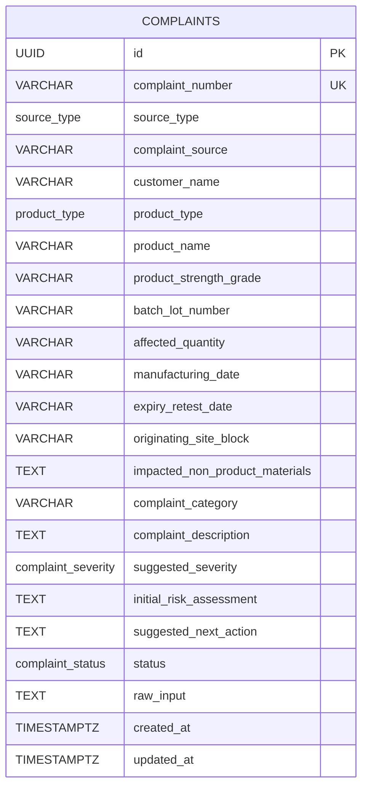
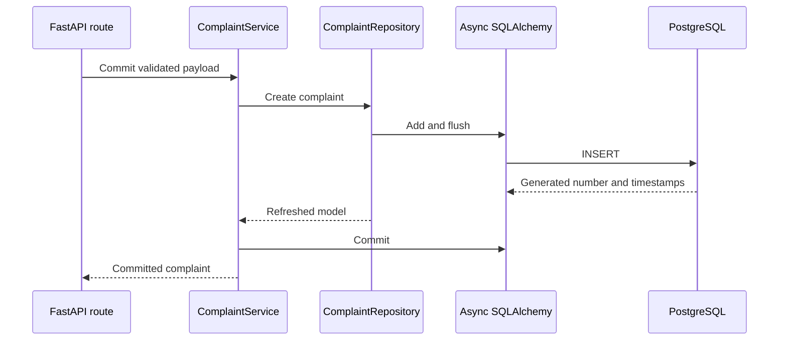

# Database Design

## 1. Overview

PostgreSQL is the system of record for explicitly committed pharmaceutical
complaints. AI processing, PDF extraction, conversational corrections, completeness,
duplicate checks, and RCA/CAPA generation operate on an in-memory draft and do not
write to the ledger automatically.

The persistence path is:

```text
FastAPI route
→ ComplaintService
→ ComplaintRepository
→ Async SQLAlchemy session
→ PostgreSQL
```

## 2. Entity relationship model



The current release uses one ledger table. Completeness results, possible duplicate
matches, and RCA/CAPA recommendations are advisory response data and are not stored as
approved quality records.

## 3. Complaints table

Table name: `complaints`

| Column                           | PostgreSQL type           | Null | Purpose                                    |
| -------------------------------- | ------------------------- | ---: | ------------------------------------------ |
| `id`                             | UUID                      |   No | Stable internal primary key                |
| `complaint_number`               | VARCHAR(32)               |   No | Unique human-readable identifier           |
| `source_type`                    | `source_type` enum        |   No | MANUAL, TEXT, or PDF                       |
| `complaint_source`               | VARCHAR(255)              |  Yes | Origin of the complaint                    |
| `customer_name`                  | VARCHAR(200)              |   No | Reporting customer                         |
| `product_type`                   | `product_type` enum       |   No | API, FDF, or UNKNOWN                       |
| `product_name`                   | VARCHAR(200)              |   No | Product or material name                   |
| `product_strength_grade`         | VARCHAR(100)              |  Yes | FDF strength or API grade                  |
| `batch_lot_number`               | VARCHAR(100)              |   No | Batch or lot identifier                    |
| `affected_quantity`              | VARCHAR(100)              |  Yes | Reported affected quantity                 |
| `manufacturing_date`             | VARCHAR(100)              |  Yes | Source-provided manufacturing date         |
| `expiry_retest_date`             | VARCHAR(100)              |  Yes | Expiry or retest information               |
| `originating_site_block`         | VARCHAR(200)              |  Yes | Manufacturing site or block                |
| `impacted_non_product_materials` | TEXT                      |  Yes | Packaging or other material context        |
| `complaint_category`             | VARCHAR(150)              |   No | Reviewed complaint category                |
| `complaint_description`          | TEXT                      |   No | Reviewed complaint description             |
| `suggested_severity`             | `complaint_severity` enum |  Yes | AI-assisted severity recommendation        |
| `initial_risk_assessment`        | TEXT                      |  Yes | Preliminary risk assessment                |
| `suggested_next_action`          | TEXT                      |  Yes | Advisory next action                       |
| `status`                         | `complaint_status` enum   |   No | Persisted workflow status                  |
| `raw_input`                      | TEXT                      |  Yes | Optional original input retained at commit |
| `created_at`                     | TIMESTAMPTZ               |   No | Database-generated creation time           |
| `updated_at`                     | TIMESTAMPTZ               |   No | Creation/update time                       |

### Required commit fields

The commit schema requires:

- Customer name
- Product name
- Batch or lot number
- Complaint category
- Complaint description

`product_type` defaults to `UNKNOWN` when the user cannot determine API or FDF.
Optional blank strings are normalized to null before persistence.

## 4. PostgreSQL enum types

### `source_type`

- `MANUAL`
- `TEXT`
- `PDF`

### `product_type`

- `API`
- `FDF`
- `UNKNOWN`

### `complaint_severity`

- `MINOR`
- `MAJOR`
- `CRITICAL`

### `complaint_status`

- `PENDING_TRIAGE`
- `READY_TO_COMMIT`
- `COMMITTED`

The current commit service persists new records with `COMMITTED` status. Earlier
status values remain part of the domain and database enum for workflow compatibility.

## 5. Complaint-number generation

PostgreSQL owns human-readable complaint-number generation through:

```sql
CREATE SEQUENCE complaint_number_seq START WITH 1;
```

The column default follows this format:

```text
CMP-YYYY-NNNNNN
```

Example:

```text
CMP-2026-000021
```

The database sequence provides concurrency-safe numbering. The UUID remains the
canonical API identifier.

## 6. Constraints and indexes

### Constraints

- Primary key: `complaints.id`
- Unique constraint: `complaints.complaint_number`
- Required-column constraints on core complaint fields
- PostgreSQL enums constrain source, product, severity, and status values
- Pydantic performs length, blank-value, and extra-field validation before persistence

### Indexes

| Index                              | Expression            | Purpose                                             |
| ---------------------------------- | --------------------- | --------------------------------------------------- |
| `ix_complaints_complaint_number`   | `complaint_number`    | Fast complaint-number lookup and uniqueness support |
| `ix_complaints_batch_lot_number`   | `batch_lot_number`    | Batch-based lookup and duplicate candidates         |
| `ix_complaints_product_name_lower` | `lower(product_name)` | Case-insensitive product matching                   |
| `ix_complaints_created_at`         | `created_at`          | Newest-first listing and candidate retrieval        |

## 7. Repository operations

`ComplaintRepository` owns database access:

| Operation                   | Behavior                                                    |
| --------------------------- | ----------------------------------------------------------- |
| `create`                    | Adds, flushes, and refreshes a complaint without committing |
| `get_by_id`                 | Retrieves one complaint by UUID                             |
| `list`                      | Returns newest-first bounded pagination and total count     |
| `find_duplicate_candidates` | Retrieves a bounded candidate set for deterministic scoring |

The repository does not call AI providers and does not own transaction commit or
rollback.

## 8. Transaction ownership

`ComplaintService.commit` owns the write transaction:



If any operation fails, the service rolls back the session and propagates a controlled
error. Read operations do not modify database state.

## 9. Session lifecycle

- FastAPI dependency injection supplies an asynchronous request-scoped session.
- The application-scoped `Database` owns the async engine and session factory.
- Sessions are closed when the request dependency exits.
- The engine is disposed during application shutdown.
- `pool_pre_ping` detects stale connections before use.
- `/ready` executes a PostgreSQL connectivity check without calling an AI provider.

## 10. Pagination

Complaint listing accepts:

- `page`: minimum 1
- `page_size`: minimum 1, maximum 100

Records are ordered by:

```sql
created_at DESC, id DESC
```

The response includes `items`, `page`, `page_size`, `total`, and
`total_pages`.

## 11. Duplicate candidate retrieval

Duplicate detection separates database retrieval from deterministic scoring.

The repository:

1. Prefers case-insensitive product-name matches or normalized batch matches.
2. Excludes the current complaint UUID when supplied.
3. Orders candidates newest first.
4. Applies a strict candidate limit.
5. Fills any remaining bounded capacity with recent complaints when necessary.

PostgreSQL uses `regexp_replace` to normalize batch identifiers for candidate
retrieval. The pure `DuplicateScorer` performs the final deterministic comparison
outside the repository. No embeddings or semantic-vector database is used.

## 12. Persistence boundaries

| Operation                   | Database effect                        |
| --------------------------- | -------------------------------------- |
| Text processing             | None                                   |
| PDF processing              | None                                   |
| Quality/risk assessment     | None                                   |
| Conversational correction   | None                                   |
| Completeness calculation    | None                                   |
| Duplicate check             | Read-only                              |
| RCA/CAPA generation         | None                                   |
| Complaint listing/retrieval | Read-only                              |
| Explicit complaint commit   | Inserts exactly one reviewed complaint |

This boundary ensures that external AI output cannot become a QMS ledger record
without an explicit reviewed commit request.

## 13. Migrations

Alembic manages the schema. The initial migration is:

```text
backend/alembic/versions/20260817_0001_create_complaints.py
```

It creates:

- Four PostgreSQL enum types
- `complaint_number_seq`
- The `complaints` table
- The complaint-number, batch, product-name, and creation-time indexes

The downgrade removes the table, sequence, and enum types. Downgrade operations must
never be run against a development or production database without explicit approval
and a verified backup/recovery plan.

## 14. Data safety and limitations

- Database credentials are supplied through `DATABASE_URL` and are never embedded in
  frontend code.
- SQLAlchemy parameterization prevents complaint data from being concatenated into raw
  SQL.
- The application does not implement authentication, tenant isolation, encryption-key
  management, electronic signatures, or a production audit trail.
- Date fields are intentionally stored as source-provided strings because complaint
  documents may contain partial or non-ISO pharmaceutical date formats.
- RCA/CAPA, duplicate, and completeness outputs are advisory and not persisted as
  approved regulatory decisions.
