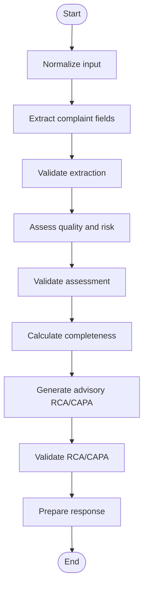
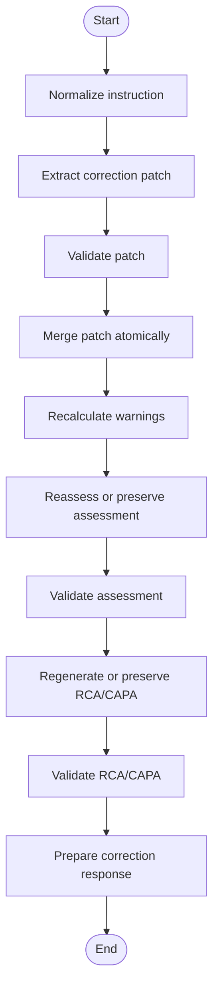
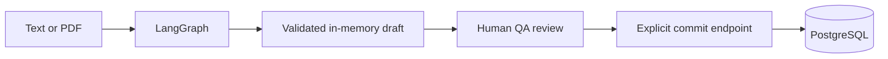

# LangGraph Workflows

## 1. Overview

The application uses two compiled LangGraph workflows:

1. Complaint processing for text and PDF-derived text
2. Conversational complaint correction

LangGraph coordinates application steps but does not own HTTP handling, database
transactions, or user-interface state. Groq interprets untrusted complaint language,
while Pydantic schemas and deterministic domain rules remain the final authority.

Neither graph writes to PostgreSQL. A complaint is persisted only through the separate
explicit commit endpoint.

## 2. Provider contract

The graphs depend on the complaint-provider protocol rather than directly constructing
the Groq SDK client.

The provider operations are:

- Extract complaint fields
- Assess complaint quality and risk
- Extract an allowlisted correction patch
- Generate advisory RCA/CAPA recommendations

The stable runtime supplies the Groq adapter. Automated tests can inject deterministic
providers through the same protocol. Fake providers are test-only and are never
runtime fallbacks.

## 3. Complaint-processing graph

The processing graph is built in:

**backend/app/ai/graph.py**

It is used by both pasted text and selectable text extracted from a PDF.



### 3.1 Normalize input

Node: **normalize_input**

Responsibilities:

- Trim leading and trailing whitespace
- Normalize repeated spaces and line breaks
- Reject blank input
- Reject text exceeding the configured maximum length
- Preserve identifiers such as batch punctuation
- Set the source type to TEXT or PDF

This stage is deterministic and does not call Groq.

### 3.2 Extract complaint fields

Node: **extract_complaint_fields**

The node sends normalized complaint content to the provider’s structured extraction
operation. A separate Groq call may be made for this stage.

Expected fields include:

- Complaint source
- Customer name
- Product type
- Product name
- Strength or grade
- Batch or lot number
- Affected quantity
- Manufacturing date
- Expiry or retest date
- Originating site or block
- Impacted non-product materials
- Complaint description

Missing facts must remain null. Complaint content is placed inside a data boundary and
is not treated as system instruction.

### 3.3 Validate extraction

Node: **validate_extraction**

The provider payload is validated against **ExtractedComplaint**.

Validation enforces:

- Supported product types
- Field length bounds
- Unknown-field rejection
- Blank-string normalization
- Nullable-field semantics

Invalid output becomes a controlled malformed-provider-response error and never
reaches the frontend draft.

The node also produces deterministic warnings for missing important fields.

### 3.4 Assess quality and risk

Node: **assess_complaint_quality**

The validated complaint is sent to the provider for a separate structured assessment.
The requested result includes:

- Complaint category
- Structured complaint description
- Suggested severity
- Severity rationale
- Initial risk assessment
- Suggested next action
- Assessment status
- Information gaps

### 3.5 Validate assessment

Node: **validate_quality_assessment**

The response is validated against **ComplaintQualityAssessment**.

Local validation:

- Restricts severity to MINOR, MAJOR, or CRITICAL
- Enforces COMPLETE or NEEDS_INFORMATION consistency
- Requires information gaps for incomplete evidence
- Forces human review to true
- Replaces provider disclaimer text with the trusted application disclaimer
- Rejects confirmed root cause and other prohibited final-decision language

### 3.6 Calculate completeness

Node: **assess_completeness**

The deterministic **ComplaintCompletenessChecker** evaluates five required fields:

- Customer name
- Product name
- Batch or lot number
- Complaint category
- Complaint description

The percentage is:

```text
present required fields × 100 ÷ 5
```

Integer division produces the final percentage. Blank and known placeholder values
count as missing. Recommended-field gaps provide guidance but do not block commit.

This node does not call Groq.

### 3.7 Generate RCA/CAPA recommendations

Node: **recommend_rca_capa**

The validated complaint and quality assessment are sent to the provider in a separate
structured call.

The requested result contains:

- Potential root-cause hypotheses
- Rationale and required evidence
- Investigation areas
- Corrective-action suggestions
- Preventive-action suggestions
- Assumptions and limitations

The output is advisory investigation support, not an approved quality decision.

### 3.8 Validate RCA/CAPA

Node: **validate_rca_capa**

The response is validated against **RcaCapaRecommendations**.

Local controls:

- Enforce list and text bounds
- Reject unknown object fields
- Force human review to true
- Replace the disclaimer with trusted application wording
- Reject confirmed root cause
- Reject approved, implemented, or closed CAPA
- Reject final release, rejection, or recall instructions

### 3.9 Prepare response

Node: **prepare_response**

The node creates a safe assistant message based on the validated result and missing
information. It instructs the user to review the form before commit.

The final processing response includes:

- Extracted complaint
- Quality assessment
- Completeness assessment
- Possible duplicate matches
- RCA/CAPA recommendations
- Validation warnings
- Assistant message
- Model identifier

Duplicate detection is coordinated by the processing service after the graph returns.
It is not a LangGraph node because it requires a request-scoped repository.

## 4. PDF coordination

PDF processing is coordinated by:

**backend/app/services/documents.py**

The service:

1. Validates filename and content type.
2. Reads the upload within a configured byte limit.
3. Validates the PDF signature.
4. Uses **PdfTextExtractor** to isolate PyMuPDF operations.
5. Enforces encryption, page-count, and text-length constraints.
6. Sends extracted text through the same complaint-processing graph.
7. Closes the upload in a finally block.

A textless PDF fails before Groq is called. Production OCR is outside scope.

## 5. Correction graph

The correction graph is built in:

**backend/app/ai/correction_graph.py**



### 5.1 Normalize instruction

Node: **normalize_instruction**

The node trims and normalizes whitespace, rejects blank instructions, and enforces the
configured correction-instruction limit.

### 5.2 Extract correction patch

Node: **extract_correction**

Groq receives:

- The current validated complaint
- The normalized correction instruction
- The correction prompt and strict patch schema

Groq returns a proposed patch only. It does not merge or persist data.

### 5.3 Validate patch

Node: **validate_patch**

The patch is validated against **ComplaintCorrectionPatch**.

Only these complaint fields may be changed:

- Complaint source
- Customer name
- Product type
- Product name
- Strength or grade
- Batch or lot number
- Affected quantity
- Manufacturing date
- Expiry or retest date
- Originating site or block
- Impacted non-product materials
- Complaint category
- Complaint description

UUID, complaint number, status, timestamps, and other protected fields are not part of
the patch schema.

Clarification requires:

- No updates
- A non-empty clarification question

Applied corrections require:

- At least one unique field update
- No clarification question

### 5.4 Merge patch

Node: **merge_patch**

The deterministic **merge_correction** function applies only validated updates to a
copy of the complaint.

Properties:

- Unrelated fields are preserved.
- Explicit null clears a nullable field.
- Duplicate field updates are rejected.
- The original complaint object is not mutated.
- All changes are returned atomically.

### 5.5 Recalculate warnings

Node: **recalculate_warnings**

Missing-field warnings are recalculated from the updated complaint.

### 5.6 Reassessment

Node: **reassess_complaint**

The correction graph traverses this node for every request.

- Relevant quality-field changes cause a new provider assessment.
- Changes limited to complaint source or customer name preserve the current validated
  assessment.
- Clarification and no-change paths preserve the validated draft.

The following node always validates the selected assessment, whether regenerated or
preserved.

### 5.7 Validate reassessment

Node: **validate_assessment**

The node applies the same strict quality-assessment and safety validation to the
regenerated or preserved assessment before the workflow continues.

### 5.8 RCA/CAPA recalculation

Node: **recommend_rca_capa**

RCA/CAPA is regenerated when a relevant complaint field changed or when no current
validated recommendation exists. Otherwise, the existing validated recommendation is
preserved deterministically.

### 5.9 Validate correction RCA/CAPA

Node: **validate_rca_capa**

The node validates regenerated or preserved recommendations against
**RcaCapaRecommendations** and the deterministic RCA/CAPA safety rules.

### 5.10 Prepare correction response

Node: **prepare_response**

The result status is:

- **APPLIED** when one or more values changed
- **CLARIFICATION_REQUIRED** when the instruction was ambiguous or protected
- **NO_CHANGES** when the requested values already exist

The response remains in memory and requires explicit user review and commit.

## 6. Processing and correction state

### Processing state

The typed processing state carries:

- Raw and normalized text
- Source type
- Provider payloads
- Extracted complaint
- Quality assessment
- Completeness assessment
- RCA/CAPA recommendations
- Information gaps and warnings
- Assistant message
- Controlled processing error
- Execution trace

### Correction state

The typed correction state carries:

- Current complaint and instruction
- Normalized instruction
- Current assessment and RCA/CAPA
- Proposed patch
- Updated complaint
- Changed fields
- Reassessment flag
- Recalculated or preserved outputs
- Warnings, status, assistant message, and execution trace

State is request-local. It is not a database record.

## 7. Provider call model

A complete processing request can make three separate structured Groq calls:

```text
Extraction
→ Quality/risk assessment
→ RCA/CAPA recommendations
```

A correction request always performs correction extraction and may also perform
quality reassessment and RCA/CAPA regeneration when relevant.

The Groq adapter:

- Uses the environment-configured model
- Requests strict JSON-schema output
- Parses JSON
- Applies strict Pydantic validation
- Allows one controlled retry for malformed output
- Does not retry authentication or rate-limit errors
- Closes each async client

## 8. Error behavior

Graph and provider failures map to controlled application errors:

| Category                    | API behavior                       |
| --------------------------- | ---------------------------------- |
| Invalid input               | 422 validation/processing response |
| Missing AI configuration    | 503 controlled response            |
| Authentication failure      | 502 controlled response            |
| Rate limit                  | 429 controlled response            |
| Timeout                     | 504 controlled response            |
| Malformed structured output | 502 controlled response            |
| Provider unavailable        | 503 controlled response            |

The frontend preserves the current draft on recoverable processing or correction
failure. No failure path automatically commits a complaint.

## 9. Persistence boundary



LangGraph has no repository or database dependency. The explicit complaint service
owns commit and rollback, and the complaint repository performs the insert.

## 10. Human-review boundary

The workflows provide decision support only.

They do not:

- Confirm root cause
- Approve or implement CAPA
- Initiate recall
- Release or reject a batch
- Close an investigation
- Make a final regulatory decision

Authorised quality personnel remain responsible for reviewing the draft, assessment,
duplicate candidates, completeness guidance, RCA/CAPA suggestions, and explicit
ledger commit.
