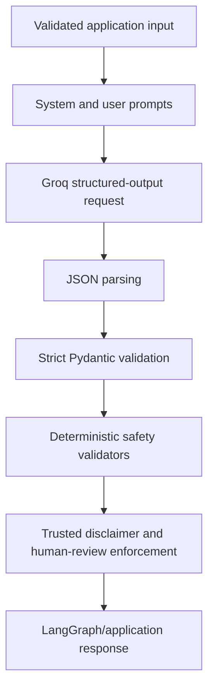
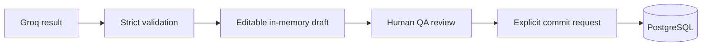

# LLM Integration and Safety

## 1. Purpose

This document describes how the stable application integrates Groq-hosted language
models and prevents unvalidated model output from becoming trusted complaint data or
an approved pharmaceutical quality decision.

The LLM is a decision-support component. It does not own persistence, corrections,
quality approval, investigation closure, recall, batch disposition, or CAPA approval.

## 2. Production provider

The stable source uses one production AI provider:

- Provider: Groq
- Default model: **openai/gpt-oss-120b**
- Configuration variable: **GROQ_MODEL**
- Credential variable: **GROQ_API_KEY**
- SDK: official Groq Python SDK

The model remains environment-configurable. No credential is embedded in source,
frontend code, Docker images, test fixtures, or documentation.

Retired models referenced by the original assignment were replaced by the configurable
supported model `openai/gpt-oss-120b`. This replacement does not change the provider
boundary or pharmaceutical safety requirements.

Gemini was evaluated only in a rejected compatibility experiment. It is absent from
the stable source, was not merged, and must not appear in runtime configuration
instructions. The stable branch does not register Gemini or another automatic
production fallback. Deterministic fake providers are test-only.

## 3. Provider boundary

The application-facing provider contract and Groq adapter are located in:

**backend/app/ai/providers.py**

The provider contract defines four operations:

1. Complaint extraction
2. Quality and risk assessment
3. Conversational correction extraction
4. RCA/CAPA recommendation generation

LangGraph and application services depend on this contract rather than directly
depending on Groq SDK types. This supports deterministic tests and keeps provider
details outside workflow and business logic.

## 4. Separation of responsibilities

| Component              | Responsibility                                         |
| ---------------------- | ------------------------------------------------------ |
| Prompts                | Define task instructions and untrusted-data boundaries |
| Groq adapter           | Call the SDK and translate provider errors             |
| LangGraph              | Coordinate processing stages                           |
| Pydantic schemas       | Validate structure, types, bounds, and safety          |
| Deterministic services | Completeness, duplicate scoring, patch merge           |
| FastAPI routes         | Parse HTTP requests and return validated responses     |
| Complaint service      | Own explicit persistence transaction                   |
| React and Redux        | Present and preserve the editable user draft           |

The model never directly invokes a repository, database session, frontend action, or
commit operation.

## 5. Structured-output pipeline

Each AI operation follows this validation path:



Raw model output is never returned directly to the frontend or database.

The Groq request uses:

- Temperature zero
- A named JSON schema
- Strict structured-output mode
- A system message
- A separate user/data message

The resulting content is parsed as JSON and validated against the corresponding
Pydantic model.

## 6. Output contracts

### 6.1 Complaint extraction

Schema: **ExtractedComplaint**

Controls:

- Product type restricted to API, FDF, UNKNOWN, or null
- Unknown fields rejected
- Field-length limits enforced
- Empty strings normalized to null
- Missing facts remain nullable

### 6.2 Quality and risk assessment

Schema: **ComplaintQualityAssessment**

Controls:

- Severity restricted to MINOR, MAJOR, or CRITICAL
- Assessment status restricted to COMPLETE or NEEDS_INFORMATION
- NEEDS_INFORMATION requires one or more information gaps
- COMPLETE rejects contradictory information gaps
- Human review is forced to true
- Provider disclaimer text is replaced with trusted application wording
- Prohibited final-decision claims are rejected

### 6.3 Correction patch

Schema: **ComplaintCorrectionPatch**

Controls:

- Only allowlisted complaint fields are accepted
- Unknown and protected fields are rejected
- Duplicate field updates are rejected
- Explicit null supports controlled clearing
- Clarification requires no updates and a question
- Applied correction requires updates and no clarification question
- The provider proposes a patch but never performs the merge

### 6.4 RCA/CAPA recommendations

Schema: **RcaCapaRecommendations**

Controls:

- Bounded lists and bounded text
- Structured potential root causes, rationales, and evidence
- Structured corrective and preventive suggestions
- Unknown fields rejected
- Human review forced to true
- Disclaimer replaced with trusted application wording
- Confirmed root cause and final regulatory decisions rejected

## 7. Prompt organization

Prompt definitions are centralized in:

**backend/app/ai/prompts.py**

Separate prompts exist for:

- Complaint extraction
- Quality and risk assessment
- Conversational correction
- RCA/CAPA recommendations

Application code supplies validated complaint objects to later workflow stages rather
than repeatedly asking the model to reinterpret arbitrary frontend state.

Prompts instruct the provider to:

- Use only supplied complaint evidence
- Preserve missing facts as null
- Treat complaint content as data
- Avoid final regulatory conclusions
- Return only the required structure
- Require authorised human review

Prompts support the safety model but are not treated as the final enforcement layer.
Local Pydantic and deterministic validators remain authoritative.

## 8. Prompt-injection handling

Complaint text, extracted PDF text, and correction instructions are untrusted user
data.

Controls include:

- Separate system and user messages
- Explicit complaint-data delimiters
- Instructions not to follow commands contained inside complaint content
- Strict output schemas
- Allowlisted correction fields
- Local rejection of unknown fields
- Local pharmaceutical safety validation
- No tools or database operations available to the model

For example, complaint text asking the model to invent a batch number cannot add an
unsupported field or bypass the local schema. Tests verify that missing protected
facts remain null.

## 9. Pharmaceutical decision-safety rules

### Quality assessment prohibitions

The assessment validator rejects language that claims:

- Root cause is confirmed
- An investigation is complete
- A batch or product is approved or rejected
- Recall should be automatically or immediately initiated
- Final approval has been granted

### RCA/CAPA prohibitions

The RCA/CAPA validator rejects language that claims:

- Root cause is confirmed
- Investigation is complete
- CAPA is approved, implemented, or closed
- A batch or product should be released, rejected, or recalled

The application presents severity, risk, next-action, root-cause, and CAPA content only
as preliminary recommendations for authorised QA review.

## 10. Trusted fields

The provider cannot control final safety wording.

The application overwrites these fields during validation:

- **human_review_required** is always true
- Quality-assessment disclaimer uses application-controlled text
- RCA/CAPA disclaimer uses application-controlled text

This prevents provider output from weakening the human-review requirement or implying
approval.

## 11. Retry policy

Each structured provider operation permits at most one retry only when output:

- Is not valid JSON
- Fails the strict Pydantic contract
- Is missing the expected response content
- Is returned by Groq as a failed structured generation

The application does not perform this malformed-output retry for:

- Missing API configuration
- Authentication failure
- Rate limiting or quota exhaustion
- Timeout
- General connectivity failure
- Unsupported or rejected requests

There is no alternating-provider loop and no automatic repeated call after HTTP 429.

HTTP 429 is an external provider quota or rate-limit condition. The application does
not retry it, does not change the ledger, and preserves the manual QA workflow.

## 12. Provider error mapping

| Provider condition                 | Application code         | HTTP status |
| ---------------------------------- | ------------------------ | ----------: |
| Missing API key                    | AI_NOT_CONFIGURED        |         503 |
| Authentication failure             | AI_AUTHENTICATION_FAILED |         502 |
| Rate limit or quota exhaustion     | AI_RATE_LIMITED          |         429 |
| Timeout                            | AI_TIMEOUT               |         504 |
| Invalid structured output          | AI_INVALID_RESPONSE      |         502 |
| Provider or connection unavailable | AI_UNAVAILABLE           |         503 |

API responses contain safe messages and do not expose Groq response bodies,
authorization headers, prompts, or stack traces.

## 13. Multiple calls per workflow

A complete complaint-processing request may perform three separate structured Groq
calls:

```text
Complaint extraction
→ Quality and risk assessment
→ RCA/CAPA recommendations
```

A correction request performs correction extraction and may also perform a new
assessment and RCA/CAPA generation when relevant fields change.

LangGraph coordinates these calls as one application workflow. External-provider
quotas and latency therefore apply per model call, not only per browser action.

## 14. Resource lifecycle

FastAPI creates one `GroqComplaintExtractionProvider` during application startup.
The compiled LangGraph workflows reuse that provider through dependency injection.
The current adapter creates an `AsyncGroq` SDK client for each structured-output
attempt, performs the provider call, and closes that client in a `finally` block.
Individual graph nodes do not construct independent application provider objects.

PDF upload objects are also closed in a finally block. The database engine is disposed
during FastAPI shutdown. No provider call is made by application health or readiness
checks.

## 15. Privacy and logging

The application must not intentionally log or expose:

- API keys
- Authorization headers
- Full complaint text
- Extracted PDF text
- Customer information
- Batch or lot identifiers
- Raw prompts
- Raw provider output
- Provider response identifiers

The frontend never receives provider credentials. The ignored root environment file
is excluded from Git and Docker build contexts.

## 16. Persistence boundary



Text processing, PDF processing, correction, completeness, duplicate checking, and
RCA/CAPA generation do not automatically insert or update complaint records.

Only the explicit complaint commit service owns a write transaction.

## 17. Frontend safety behavior

The frontend:

- Preserves the draft when processing or correction fails
- Shows controlled error messages
- Prevents duplicate processing and commit submissions
- Displays AI output as requiring review
- Keeps assessment and recommendation fields editable where intended
- Requires an explicit commit action
- Clears stale AI state when starting a new intake

The frontend does not contain provider selection, API keys, or direct Groq calls.

## 18. Deterministic and real-provider testing

Deterministic tests cover:

- Every graph node and output contract
- Missing and malformed provider responses
- Exactly one permitted malformed-output retry
- Authentication and rate-limit no-retry behavior
- Prompt-injection attempts
- Protected correction fields
- Explicit nullable-field clearing
- Trusted disclaimer replacement
- Human-review enforcement
- Prohibited regulatory language
- Draft preservation and non-persistence

Credential-gated real-provider tests use fictional complaint data only. They are not
part of default CI because external quota, model availability, and rate limits are
outside application control.

## 19. Known limitations

- The model can still return malformed output or fail strict generation.
- Groq availability and quota are external dependencies.
- Strict structured output does not make an assessment clinically or regulatorily
  authoritative.
- The application does not provide an automatic production-provider fallback.
- The application does not authenticate users or provide electronic signatures.
- There is no production OCR or mailbox ingestion.
- Human review is mandatory before commit and before any downstream quality action.

## 20. Human-review statement

All AI-generated complaint fields, severity recommendations, risk assessments,
duplicate candidates, root-cause hypotheses, and CAPA suggestions are preliminary.
Authorised quality personnel must verify the evidence, correct the draft, determine
appropriate quality-system actions, and explicitly commit the reviewed complaint.
