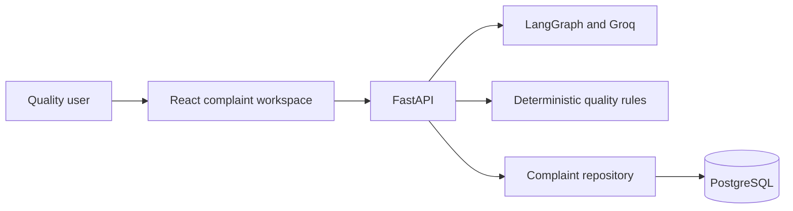

# Software Requirements Specification

## 1. Purpose

This document defines the requirements for the AI-Powered Pharmaceutical Customer
Complaint Management System. The application assists authorised quality personnel
with complaint intake, structured extraction, preliminary quality assessment,
controlled corrections, investigation support, and explicit entry into a QMS ledger.

The application is an assignment-scale decision-support workflow. It does not make
final regulatory or product-disposition decisions.

## 2. Scope

The system supports:

- Manual pharmaceutical complaint entry
- Text and email-style complaint intake
- Selectable-text PDF intake
- Structured complaint-field extraction
- API and FDF product contexts
- Preliminary quality and risk assessment
- Conversational correction of allowlisted fields
- Deterministic completeness assessment
- Deterministic possible-duplicate detection
- Advisory RCA/CAPA recommendations
- Explicit human-reviewed commit to PostgreSQL
- Retrieval of committed complaints

The system does not include production OCR, mailbox integration, authentication,
electronic signatures, semantic duplicate matching, autonomous recall, final batch
disposition, regulatory approval, or investigation closure.

## 3. Users

### Primary user

An authorised pharmaceutical quality or complaint-handling professional who:

- Receives complaint information
- Reviews AI-extracted fields
- Corrects incomplete or inaccurate information
- Reviews preliminary assessment and investigation suggestions
- Explicitly commits the reviewed complaint

### Reviewer

A project reviewer or developer who verifies the workflow using fictional sample data,
API documentation, automated tests, and the browser interface.

## 4. System context



Groq is the only production AI provider in the stable source. The model is configured
through `GROQ_MODEL`, with `openai/gpt-oss-120b` as the default. Deterministic fake
providers are restricted to tests.

## 5. Functional requirements

### 5.1 Health and readiness

| ID     | Requirement                                                              |
| ------ | ------------------------------------------------------------------------ |
| FR-001 | The system shall expose `GET /health` for application liveness.          |
| FR-002 | The system shall expose `GET /ready` and verify PostgreSQL connectivity. |
| FR-003 | Health and readiness checks shall not call an external AI provider.      |

### 5.2 Manual complaint management

| ID     | Requirement                                                                     |
| ------ | ------------------------------------------------------------------------------- |
| FR-010 | The user shall be able to enter and edit complaint fields manually.             |
| FR-011 | The frontend shall validate required commit fields before submission.           |
| FR-012 | The backend shall validate the complete commit payload.                         |
| FR-013 | The system shall persist a complaint only after explicit commit.                |
| FR-014 | A committed complaint shall receive a UUID and human-readable complaint number. |
| FR-015 | The system shall list committed complaints with bounded pagination.             |
| FR-016 | The system shall retrieve a committed complaint by UUID.                        |

### 5.3 Text and email-style intake

| ID     | Requirement                                                                                       |
| ------ | ------------------------------------------------------------------------------------------------- |
| FR-020 | The user shall be able to paste complaint text for processing.                                    |
| FR-021 | The backend shall reject blank or oversized text.                                                 |
| FR-022 | LangGraph shall coordinate extraction, validation, assessment, completeness, and RCA/CAPA stages. |
| FR-023 | Extracted fields shall populate an editable draft without automatic persistence.                  |
| FR-024 | Missing information shall remain null rather than being presented as confirmed fact.              |
| FR-025 | Complaint content shall be treated as untrusted data, not system instruction.                     |

### 5.4 PDF intake

| ID     | Requirement                                                                                                            |
| ------ | ---------------------------------------------------------------------------------------------------------------------- |
| FR-030 | The user shall be able to upload or drop a PDF complaint.                                                              |
| FR-031 | The backend shall validate filename, content type, signature, size, page count, encryption, and extracted-text length. |
| FR-032 | Selectable PDF text shall enter the same workflow as pasted text.                                                      |
| FR-033 | A textless or scanned PDF shall produce a controlled error.                                                            |
| FR-034 | A PDF-processing failure shall preserve the selected document and complaint draft where supported by the client.       |
| FR-035 | Production-grade OCR is not required.                                                                                  |

### 5.5 Structured extraction

The system shall support these nullable extraction fields:

- Complaint source
- Customer name
- Product type
- Product name
- Product strength or grade
- Batch or lot number
- Affected quantity
- Manufacturing date
- Expiry or retest date
- Originating site or block
- Impacted non-product materials
- Complaint description

| ID     | Requirement                                                                       |
| ------ | --------------------------------------------------------------------------------- |
| FR-040 | Product type shall be API, FDF, UNKNOWN, or null.                                 |
| FR-041 | Provider output shall be parsed as JSON and validated by strict Pydantic schemas. |
| FR-042 | Unknown output fields shall be rejected.                                          |
| FR-043 | Invalid or malformed provider output shall not populate the draft.                |
| FR-044 | The provider may receive at most one controlled malformed-output retry.           |

### 5.6 Quality and risk assessment

| ID     | Requirement                                                                       |
| ------ | --------------------------------------------------------------------------------- |
| FR-050 | Processing shall return a complaint category.                                     |
| FR-051 | Processing shall recommend MINOR, MAJOR, or CRITICAL severity.                    |
| FR-052 | Processing shall return a severity rationale.                                     |
| FR-053 | Processing shall return an initial risk assessment.                               |
| FR-054 | Processing shall return a suggested next action.                                  |
| FR-055 | Incomplete evidence shall produce NEEDS_INFORMATION with explicit gaps.           |
| FR-056 | Assessment output shall always require human review.                              |
| FR-057 | The application shall replace provider disclaimer text with a trusted disclaimer. |

### 5.7 Conversational corrections

| ID     | Requirement                                                                                                |
| ------ | ---------------------------------------------------------------------------------------------------------- |
| FR-060 | The user shall be able to request corrections using natural language.                                      |
| FR-061 | Only allowlisted complaint fields may be changed.                                                          |
| FR-062 | Complaint UUID, number, status, timestamps, and other protected fields shall not be changed.               |
| FR-063 | Ambiguous instructions shall request clarification without modifying the draft.                            |
| FR-064 | Explicitly nullable fields may be cleared.                                                                 |
| FR-065 | Unrelated fields shall remain unchanged.                                                                   |
| FR-066 | Relevant changes shall trigger quality, completeness, duplicate, and RCA/CAPA recalculation as applicable. |
| FR-067 | A failed correction shall preserve the current validated draft atomically.                                 |
| FR-068 | Correction shall not persist the complaint automatically.                                                  |

### 5.8 Completeness

| ID     | Requirement                                                                                                                      |
| ------ | -------------------------------------------------------------------------------------------------------------------------------- |
| FR-070 | Completeness shall be calculated deterministically.                                                                              |
| FR-071 | Required fields shall be customer name, product name, batch/lot number, complaint category, and complaint description.           |
| FR-072 | Completeness percentage shall equal the integer percentage of present required fields divided by the five total required fields. |
| FR-073 | Placeholder or blank values shall count as missing.                                                                              |
| FR-074 | Missing recommended fields shall provide guidance but shall not block manual commit.                                             |

### 5.9 Duplicate detection

| ID     | Requirement                                                                               |
| ------ | ----------------------------------------------------------------------------------------- |
| FR-080 | Duplicate detection shall retrieve a bounded set of recent PostgreSQL candidates.         |
| FR-081 | Duplicate scoring shall be deterministic and database-independent.                        |
| FR-082 | Results shall contain no more than five possible matches.                                 |
| FR-083 | Batch, product, category, description, and quantity evidence may contribute to the score. |
| FR-084 | Description similarity alone shall not identify a possible match.                         |
| FR-085 | Duplicate results shall be advisory and require human review.                             |

### 5.10 RCA/CAPA recommendations

| ID     | Requirement                                                                                     |
| ------ | ----------------------------------------------------------------------------------------------- |
| FR-090 | The system shall provide potential root-cause hypotheses with rationales and required evidence. |
| FR-091 | The system shall provide investigation areas.                                                   |
| FR-092 | The system shall provide advisory corrective and preventive actions.                            |
| FR-093 | Root causes shall remain explicitly unconfirmed.                                                |
| FR-094 | CAPA actions shall remain unapproved and unimplemented suggestions.                             |
| FR-095 | The system shall reject prohibited final-decision language.                                     |
| FR-096 | RCA/CAPA output shall always require authorised human review.                                   |

## 6. API requirements

| Method | Endpoint                           | Purpose                                | Persistence        |
| ------ | ---------------------------------- | -------------------------------------- | ------------------ |
| GET    | `/health`                          | Application liveness                   | None               |
| GET    | `/ready`                           | PostgreSQL readiness                   | None               |
| POST   | `/api/complaints/process-text`     | Process pasted complaint text          | None               |
| POST   | `/api/complaints/process-document` | Process a PDF complaint                | None               |
| POST   | `/api/complaints/correct`          | Apply a conversational correction      | None               |
| POST   | `/api/complaints/check-duplicates` | Check possible duplicates              | Read-only          |
| POST   | `/api/complaints`                  | Explicitly commit a reviewed complaint | Inserts one record |
| GET    | `/api/complaints`                  | List committed complaints              | Read-only          |
| GET    | `/api/complaints/{complaint_id}`   | Retrieve one committed complaint       | Read-only          |

API failures shall use the standard envelope:

```json
{
  "error": {
    "code": "ERROR_CODE",
    "message": "Safe user-facing message",
    "details": null
  }
}
```

## 7. Data requirements

The committed complaint ledger shall store:

- UUID and generated complaint number
- Source type
- Customer and complaint source
- Product type, name, strength, or grade
- Batch or lot number and affected quantity
- Manufacturing and expiry/retest dates
- Site and non-product material context
- Complaint category and description
- Suggested severity
- Initial risk assessment
- Suggested next action
- COMMITTED status
- Creation and update timestamps

The database shall index complaint number, batch/lot number, normalized product name,
and creation time. Complaint numbers shall be generated through a PostgreSQL sequence.

## 8. Business rules

| ID     | Rule                                                                                                               |
| ------ | ------------------------------------------------------------------------------------------------------------------ |
| BR-001 | AI output is advisory and cannot represent final quality approval.                                                 |
| BR-002 | Processing and correction shall never create a ledger record.                                                      |
| BR-003 | Only explicit commit may insert a complaint.                                                                       |
| BR-004 | The service owns commit and rollback; repositories do not independently commit.                                    |
| BR-005 | Missing facts shall remain null or be listed as information gaps.                                                  |
| BR-006 | Human-review flags and disclaimers are controlled by the application.                                              |
| BR-007 | Final recall, release, rejection, batch disposition, investigation closure, or confirmed root cause is prohibited. |
| BR-008 | Duplicate, completeness, and RCA/CAPA outputs are decision-support information only.                               |

## 9. Non-functional requirements

### Security and privacy

- Secrets shall be loaded from ignored environment files or deployment variables.
- API keys shall not be exposed through frontend bundles, health endpoints, logs, or
  API errors.
- SQL operations shall use SQLAlchemy parameterization.
- File uploads and text input shall have configured bounds.
- Complaint text and raw provider output shall not be logged unnecessarily.

### Reliability

- PostgreSQL readiness shall be checked independently of AI availability.
- Database sessions and engines shall be cleaned up asynchronously.
- Uploaded files and Groq clients shall be closed.
- Controlled provider errors shall preserve the user’s draft.
- Provider rate-limit and authentication failures shall not create retry loops.

### Maintainability

- Frontend, API, service, domain, repository, AI, document, and persistence
  responsibilities shall remain separated.
- Provider and repository contracts shall support deterministic test doubles.
- Formatting, linting, strict typing, and automated tests shall remain part of the
  quality gate.

### Usability and accessibility

- Critical inputs and actions shall have accessible labels.
- Processing and commit actions shall prevent duplicate submission.
- Errors shall use clear user-facing messages.
- AI-generated content shall be visibly identified as requiring QA review.

## 10. Deployment requirements

Docker Compose shall provide:

- PostgreSQL on port 5432
- FastAPI backend on port 8000
- Nginx-served React frontend on port 5173

The backend shall wait for healthy PostgreSQL. The frontend shall depend on backend
health. Environment configuration shall include:

- `DATABASE_URL`
- `GROQ_API_KEY`
- `GROQ_MODEL`
- `CORS_ORIGINS`
- `MAX_UPLOAD_SIZE_MB`
- `MAX_CORRECTION_INSTRUCTION_LENGTH`
- `MAX_PDF_PAGES`
- `MAX_PDF_TEXT_LENGTH`
- `MAX_TEXT_INPUT_LENGTH`

## 11. Acceptance criteria

The system is acceptable when:

1. Manual, text, and selectable-text PDF intake populate the editable form.
2. API and FDF complaints are represented correctly.
3. Quality, severity, risk, next-action, completeness, duplicate, and RCA/CAPA outputs
   pass strict validation.
4. Conversational correction supports updates, clarification, protected fields, and
   explicit clearing without mutating unrelated data.
5. Processing and correction leave the ledger count unchanged.
6. Explicit commit inserts exactly one complaint.
7. A committed complaint remains retrievable after backend restart.
8. PostgreSQL and backend health checks pass.
9. Backend and frontend static checks and tests pass.
10. No credentials or generated artifacts are tracked.

## 12. Constraints and limitations

- A configured Groq account and available quota are required for real AI processing.
- External provider availability and rate limits are outside application control.
- PDF support is limited to readable selectable text.
- Duplicate matching is deterministic, not semantic.
- No production identity, access control, electronic signatures, or audit-signature
  workflow is included.
- No final regulatory decision is made by the application.
- Human review remains mandatory before explicit commit and any downstream quality
  action.
